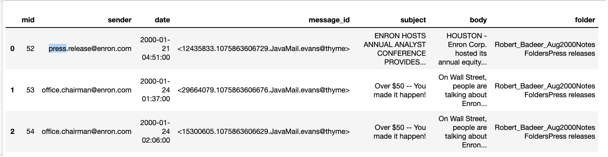
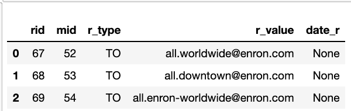
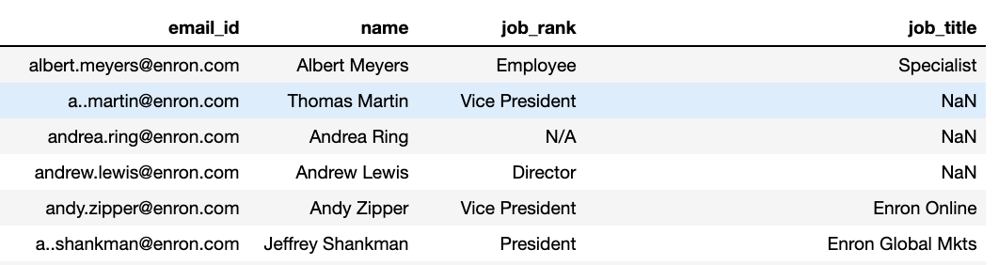

# Enron Email Identification
**Using Graph Algorithms to segemnt participants in an information network and Identify meaningful patterns in email communication**
 Nathan Laird
 
[Linkedin](http://www.linkedin.com/in/nathn-laird) | [Github](https://github.com/nathanlaird)

## Table of Contents

* [Motivation](#motivation)
  * [Personal](#personal)
  * [Business](#business)
* [Data Understanding](#data-understanding)
  * [Data Sources](#data-sources)
  * [Data Processing](#data-processing)
  * [Evaluation](#evaluation)
* [Future Improvements](#future-improvements)
* [Built With](#built-with)
* [Acknowledgements](#acknowledgements)
* [Contact Me](#contact-me)

## Motivation

### Personal

While working at Netskope I became fascinated helping others manage risk and uncertainty, I got to a variety of people all working on the goal of securing those things that are most precious to them. I was enamoured by the idea that looking at network data could create models to better inform people about the risks they face.

### Business

96% percent of all cyber attacks begin via email. identifying anomalous emails is difficult for many reasons, one of which is that Anomalous Behavior for one user could be completely normal for another. By grouping users by thier position in the communication network I want to create a model to predict group membership by email content. If a user sending or recieving a large number of emails that dissimiliar in terms of content from thier peers, this could be a sign of anomalous behavior that deserves more investagation.

## Data Understanding

### Data Sources

* [CMU Enron Dataset](https://www.cs.cmu.edu/~enron/) 

* Emails - Contains the subject and body of the emails with a reference column mid(message id)

* Email Reference - Contains a mapping of messeage ids to its recipients

* Jobs - Contains a maping Enron users to thier job title and level, many missing values, 42 values missing for Job Rank

### Data Processing

To create a network of emails, we create a square zero matrix with length equal our number of users. Then, Iterating through all messages increase the weights in the matrix  between sender and reciver.

for each non zero entry in the matrix create an edge between the sender and reciever node in the network

A Note - this creates incredible dense graphs that are hard to visualize

In order to create networks which are less dense and to limit the number of neighbors for each node, create a threshold percentage and remove all edges that have weight less the desired percentile

To Begin Looking at the network of Users I selected Jeff Skelling as central figure and arranged the network based on each nodes distance to Jeff Skelling

Here nodes are colored by thier proximity to Jeff and are pulled towards thier other neighbors. this creates a graph with multiple tendrils which Jeff looks like a singe arm of.

To view this from a more Heirachical perspective I changed the starting position to be a tree originating with Jeff in red.

Starting in this position yeilds even more defined tendrils potentially indicating a potential discovery of divisions. users who communicate heavily with each other but less so outside thier tendril

Using Job title data I looked through users with a strong relation to Jeff Skelling, does proximity to the CEO predict job status ie President VP Director.

While most users close to Jeff were Presedents and VPs several were employees indicating that while proximity to the CEO is a strong idicator of being an important member of the company it is not absoloute.

I next clustered users into respective levels and vizualized the network in a heirachical form

this visualization shows the edges for each group of nodes separately to illistrate how the different levels connect to one another

### Evaluation

## Future Improvements

## Built With

* [Python](https://www.python.org/)
* [AWS EC2](https://aws.amazon.com/ec2/)
* [Pandas](https://pandas.pydata.org/)
* [Numpy](http://www.numpy.org/)
* [Matplotlib](https://www.matplotlib.org/)

## Acknowledgements

* [Galvanize](https://www.galvanize.com/) and the Data Science Immersive Team, for their guidance and support.

## Contact Me

Nathan Laird is a Data Science Fellow at Galvanize, I have experience modeling and working with large messy Datasets. My interests include, Cloud Security, Insurance, Education,Non-profits. You can contact him at:

* Linkedin: [in/nathan-laird](http://www.linkedin.com/in/nathan-laird)
* 
* Github: [@nathanlaird](https://github.com/nathanlaird)

